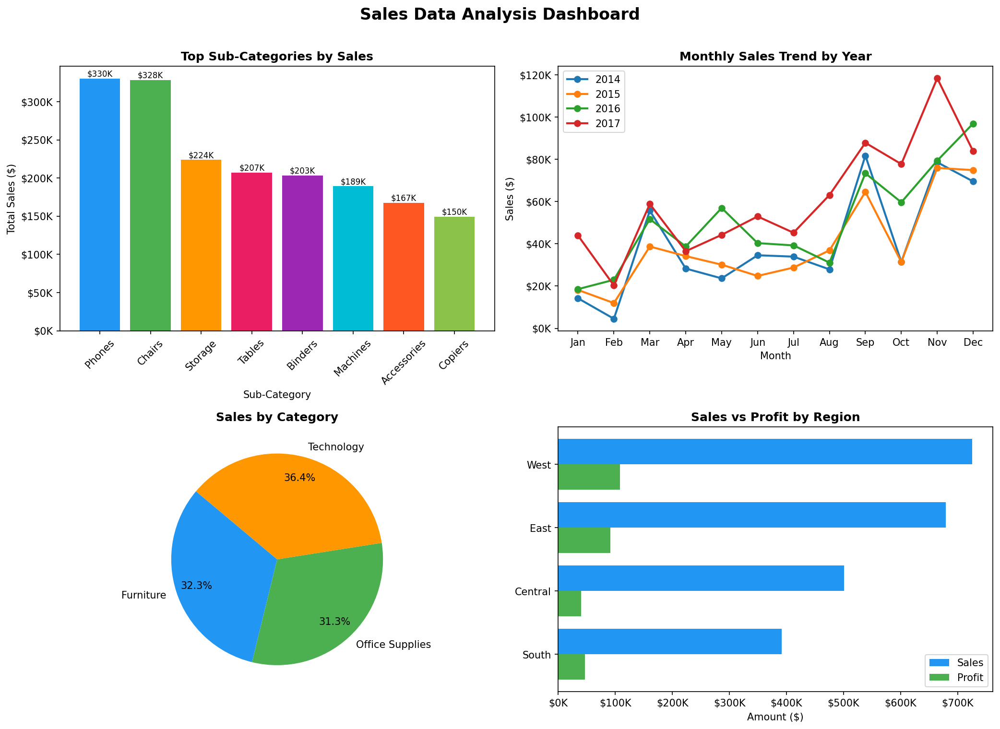

# 📊 Sales Data Analysis Dashboard

## Project Overview

This project analyzes the Superstore Sales Dataset using Python and creates both static and interactive dashboards to uncover business insights.

## Features

✅ Data Cleaning and Preprocessing

✅ Missing Value Analysis

✅ Duplicate Record Removal

✅ Sales and Profit KPI Analysis

✅ Monthly Sales Trend Analysis

✅ Category-wise Sales Distribution

✅ Region-wise Sales and Profit Comparison

✅ Top Selling Sub-Categories Analysis

✅ Interactive Plotly Dashboard

## Key Metrics Calculated

- Total Sales
- Total Profit
- Total Orders
- Profit Margin (%)

## Dashboard Components

### Static Dashboard (Matplotlib)
- Top Sub-Categories by Sales
- Monthly Sales Trend
- Sales by Category
- Sales vs Profit by Region

### Interactive Dashboard (Plotly)
- Interactive Bar Charts
- Interactive Line Charts
- Interactive Pie Charts
- Interactive Region Performance Analysis

## Key Business Insights

The dashboard identifies:

- Best Performing Region
- Highest Sales Category
- Top Selling Sub-Category
- Lowest Profit Category
- Overall Profit Margin

## Technologies Used

- Python
- Pandas
- Matplotlib
- Plotly
- NumPy

## Dataset

Sample Superstore Dataset

## Dashboard Preview

## Interactive Dashboard

[View Interactive Dashboard](dashboard/sales_dashboard_interactive.html)

## Files

- sales_analysis.py
- sales_dashboard_interactive.html
- sales_dashboard_static.png
- Sample - Superstore.csv

## Author

Yug H K
